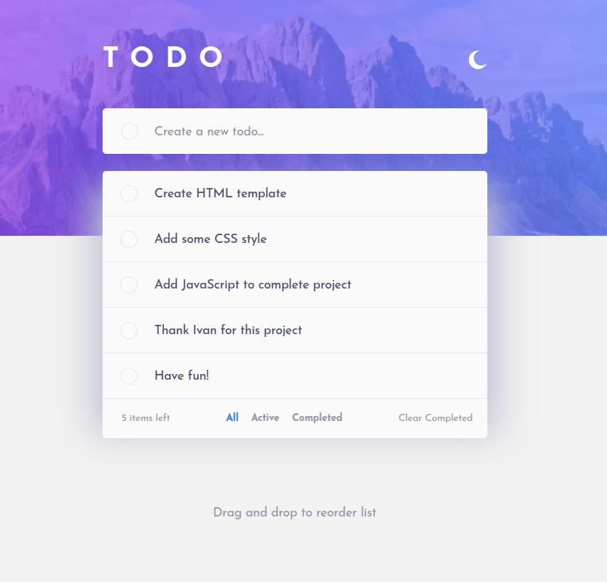
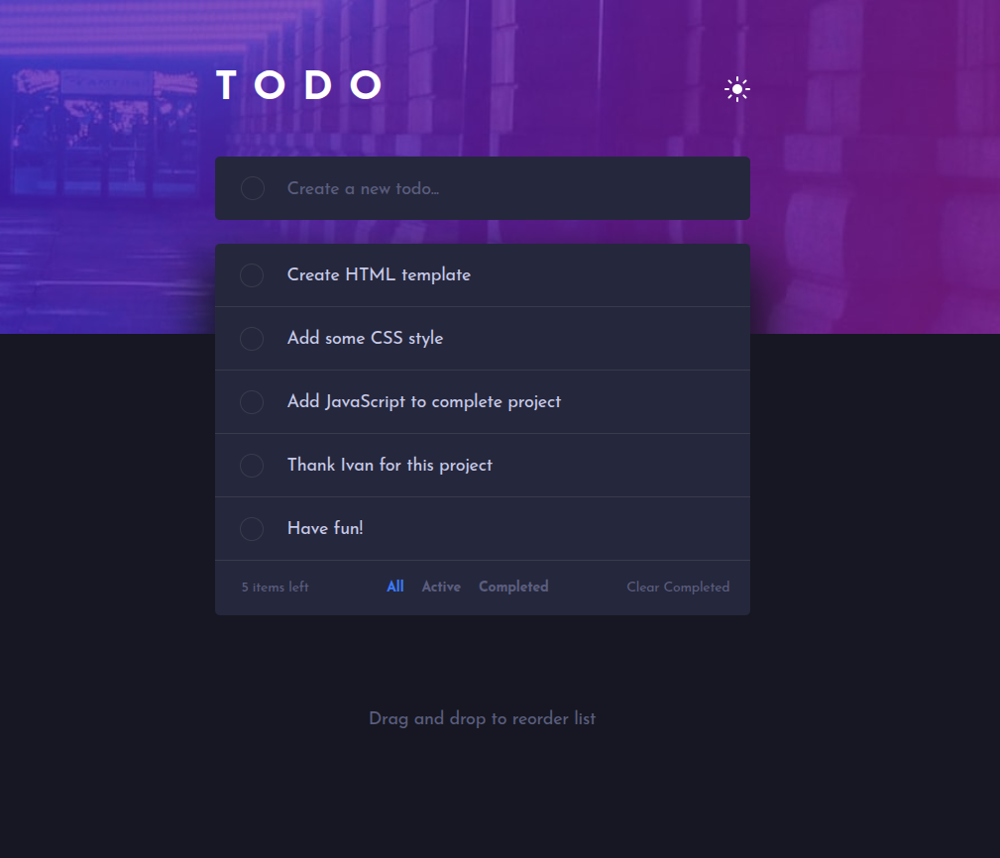
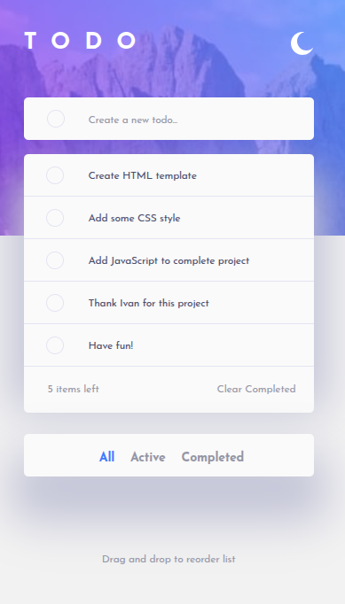
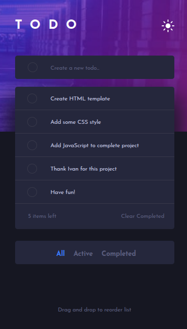

# Frontend Mentor - Todo app solution

This is a solution to the [Todo app challenge on Frontend Mentor](https://www.frontendmentor.io/challenges/todo-app-Su1_KokOW). Frontend Mentor challenges help you improve your coding skills by building realistic projects. 

## Table of contents

- [Frontend Mentor - Todo app solution](#frontend-mentor---todo-app-solution)
  - [Table of contents](#table-of-contents)
  - [Overview](#overview)
    - [The challenge](#the-challenge)
    - [Screenshot](#screenshot)
    - [Links](#links)
  - [My process](#my-process)
    - [Built with](#built-with)
    - [What I learned](#what-i-learned)
      - [CSS](#css)
      - [Javascript](#javascript)
    - [Useful resources](#useful-resources)
  - [Acknowledgments](#acknowledgments)


## Overview

### The challenge

Users should be able to:

- View the optimal layout for the app depending on their device's screen size
- See hover states for all interactive elements on the page
- Add new todos to the list
- Mark todos as complete
- Delete todos from the list
- Filter by all/active/complete todos
- Clear all completed todos
- Toggle light and dark mode
- **Bonus**: Drag and drop to reorder items on the list

### Screenshot





### Links

- Git: [Git Repository](https://github.com/slavon213/todo-app-Ivan)
- Live Site URL: [Git Pages](https://slavon213.github.io/todo-app-Ivan/)

## My process

### Built with

- Semantic HTML5 markup
- CSS custom properties
- Flexbox
- JavaScript

### What I learned


#### CSS

Під час виконання повторив знання з CSS по властивостям `background`, `Flex`, `transform: translate`.

:bulb: Для того, щоб зробити бордер кольоровим градієнтом при `hover`, використав такий прийом:
```css
 li input[type="checkbox"] ~ .checkmark:hover {
        border-color: transparent;
        background: linear-gradient(var(--bg-todos), var(--bg-todos)) padding-box,
            linear-gradient(135deg, #57ddff, #c058f3) border-box;
    }
```

Результат:  

---

:bulb: Для  анімації переходу зі стану `display: none;` до `display: block;` використав такий прийом від автора **Kevin Powell**:

```css
/*  стан перед hover*/
.remove {
    display: none;
    opacity: 0;
    transition-property: display opacity;
    transition-duration: var(--transition-end);
    transition-behavior: allow-discrete;
}

/* стан hover */

.remove {
            transition-property: display opacity;
            transition-duration: var(--transition-start);
            display: block;
            opacity: 1;

            @starting-style {
                opacity: 0;
            }
        }
```


#### Javascript

:bulb: Для перемикання кольорової теми використав стан `:checked` елемента `checkbox`:

```javascript

theme.addEventListener("click", () => {
    document.querySelector("body").classList = [theme.checked ? "light-theme" : "dark-theme"];
});
```
:bulb: Для сортування списку завдань з допомогою перетягування  використав Drag&Drop API. Визначав, на верхню чи нижню половину висоти елемента наведений курсор миші і відповідно вставляв елемент вище або нижче:

```javascript
itemLi.addEventListener("drop", (e) => {
            const rect = e.target.getBoundingClientRect();
            const itemY = e.clientY;
            const halfLi = rect.top + rect.height / 2;

            if (itemY < halfLi) {
                e.target.parentNode.insertBefore(draggedElement, itemLi);
            } else {
                e.target.parentNode.insertBefore(draggedElement, itemLi.nextSibling);
            }
            e.target.classList.remove("dragged");
        });
```


:bulb: Для контролю над шириною екрану використав `matchMedia()`:

```javascript
const match = matchMedia("(max-width: 550px)");

match.addEventListener("change", ({ matches }) => {
    movingFilter(matches);
});
```


### Useful resources

- [Відео Kevin Powell про transitions для display](https://www.youtube.com/watch?v=vmDEHAzj2XE) -- автор показує різні способи додавання ефекту переходів з стану `display: none;` до `display: block;`
- [Стаття про gradient-borders](https://codyhouse.co/nuggets/css-gradient-borders) -- автор демонструє різні підходи до формування кольорового градієнту на `border`.


## Acknowledgments

Дякую Івану за макет і знання :wave:

